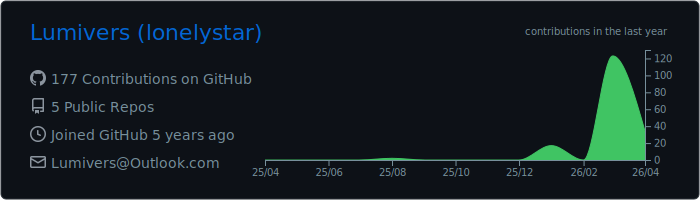
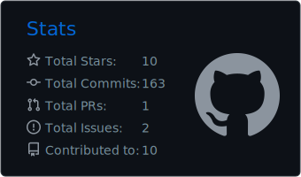
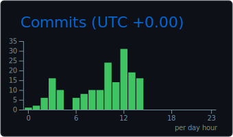
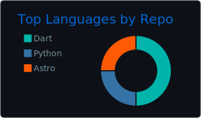
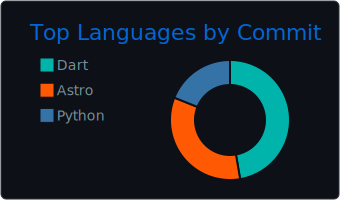

  
  

  

    
    
  

### 🚀 Overview
Software Engineering student focusing on **Cross-platform Development**, **Game Engineering**, and **AI Applications**. 

I am interested in building efficient bridges between backends and frontends, while deepening my understanding of real-time rendering and AI Agent infrastructures.

---

  
<b>🇨🇳 中文版个人简介 (点击展开)</b>

  
你好！我是 <b>Lumivers</b>，一名专注于<b>跨平台架构</b>、<b>游戏客户端工程</b>与<b>AI 相关</b>的开发者。

  
  
我的技术实践主要集中在以下三个领域：

  <ul>
    <li><b>AI Agent 基础设施：</b> 主导开发了 <b>Lumi-Hub</b>，深度集成 <b>Model Context Protocol (MCP)</b> 协议，探索私有化 AI 智能体的工程化落地。</li>
    <li><b>跨端开发：</b> 熟悉 <b>Flutter & Python/C++</b> 混合架构，擅长处理复杂的跨进程通信 (IPC) 与异步逻辑调度，拥有万行级核心业务代码的工程经验。</li>
    <li><b>游戏技术与图形学：</b> 热衷于实时渲染与引擎架构，目前正深入探究 <b>C++</b>，目标成为一名追求极致性能的游戏客户端工程师。</li>
  </ul>

  
目前我还在 <b>NUC Epoch</b> 战队中担任感知组成员，负责视觉感知链路的系统集成与逻辑优化。

  
  
我坚信“idea是生产的第一要素”。如果你对跨端技术或 AI 智能体感兴趣，欢迎通过 <a href="mailto:Lumivers@outlook.com">Lumivers@outlook.com</a> 与我交流。

### 📂 Featured Projects

#### 🛠 [Lumi-Hub](https://github.com/Lumivers/Lumi-Hub) | Private AI Agent Terminal
- **Cross-platform Logic:** Developed a bridge between a **Flutter** frontend and an asynchronous **Python** backend, managing 12k+ lines of core code.
- **Agent Integration:** Implemented **Model Context Protocol (MCP)** and AstrBot integration, exploring tool-calling and extensible plugin architectures.
- **System Design:** Worked on inter-process communication (IPC) and local data persistence to improve user experience.

#### 🎮 Game & Graphics Exploration
- **Learning Path:** Studying **C++** and **OpenGL** to understand the fundamental mechanics of game engine rendering pipelines.
- **Goal:** Aspiring Game Client Engineer with a focus on performance and game logic.

#### 🤖 RoboCon 2026 - Perception Logic | [NUC Epoch] (private repo)
*Perception Group Member | Competition Theme: "Kung Fu Quest"*
- **System Integration:** Participating in the integration of perception modules into the robot's control flow.
- **Logic Optimization:** Assisting in the maintenance and optimization of the vision-to-action pipeline (Internal/Proprietary).

---

### 🛠 Technical Stack

| Category | Skills |
| :--- | :--- |
| **Languages** | C++, Dart (Flutter), Python, C# (Unity) |
| **AI & Agents** | MCP (Model Context Protocol), AstrBot Framework, Agentic Workflows |
| **Cross-platform** | Flutter Method Channels, Asynchronous Programming |
| **Game Dev** | OpenGL, Unity, Shaders (GLSL/HLSL), Game Architecture |

### 📊 Development Activities

  

    
  

  

    
    
  

  

    
    
  

---

### 📫 Get in Touch
- **Email:** `Lumivers@outlook.com`

  <i>"May this journey lead us starward."</i>

